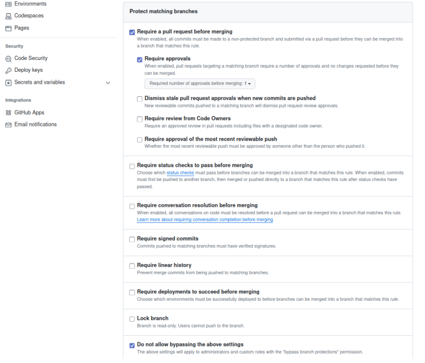

# Tarea C

## Integrantes
- **González Zavala Ulises Rodrigo** [319246128] :shipit:
- **Carlo Magno Romero Calixto** [320187890] :shipit:

---

## Introducción

En esta tarea se refuerza el conocimiento sobre el uso de las **`structs`** en lenguaje C.

Se anexan capturas de los ejercicios **6** y **7**, los cuales consideramos los más completos, y que se encuentran en nuestro repositorio.  
Además, incluimos una explicación de cómo ejecutar nuestros códigos.

---

## Ejercicio 6
<a href="https://github.com/UliRodGonzZa/3TareaC/raw/main/Ejercicio6.c" download style="text-decoration: none; background-color: #4CAF50; color: white; padding: 10px 20px; border-radius: 5px;">Descargar Ejercicio 6 </a>

.png)
.png)
.png)

---

## Para la ejecuion del programa 6:

```bash
gcc Ejercicio6.c -o Ej6
./Ej6
```

---

## Ejercicio 7
<a href="https://github.com/UliRodGonzZa/3TareaC/raw/main/Ejercicio7.c" download style="text-decoration: none; background-color: #4CAF50; color: white; padding: 10px 20px; border-radius: 5px;">Descargar Ejercicio 7 </a>

.png)
.png)
.png)

## Para la ejecuion del programa 7:

```bash
gcc Ejercicio7.c -0 Ej7
./Ej7
```
---
<div style="background-color: #f8d7da; padding: 15px; border-radius: 5px; border: 1px solid #f5c6cb;">
<strong>⚠️ NOTA:</strong> Este repositorio tiene la opción de realizar los <em>merge</em> de manera automática después de que otro colaborador acepte la solicitud del <em>Pull Request (PR)</em>.
</div>

**_Se muestran comprobaciones:_**

- Solicitud de PR con opción **enable auto-merge**
.png)


- Solicitud aceptada con merge automático
.png)

- Regla en rama **main** para poder trabajar con el merge automático:




  


